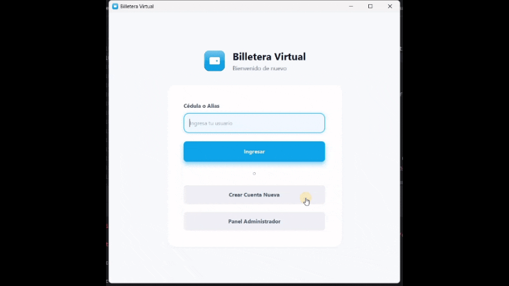

# Billetera Virtual
Materia: Programación Orientada a Objetos | Periodo: 2025-2 | Estado: Completado

## Equipo de trabajo
- Rafael Brito ([jBrito2002](https://github.com/jBrito2002))
- Paula Martillo ([bypaupau](https://github.com/bypaupau))
- José Viteri ([jvit04](https://github.com/jvit04))

## Capturas / Demo


## Funcionalidad
- [x] Arquitectura Orientada a Objetos y Polimorfismo: Modelado modular del negocio mediante una clase abstracta madre `Transaccion` de la cual heredan de forma especializada las clases concretas `Deposito`, `Retiro`, `Transferencia` y `PagoServicio`. [Commit](https://github.com/jvit04/Proyecto_POO_BilleteraVirtual/commit/7a6aaec2b0848230b5a0285fb3cc304a8cccddb2)
- [x] Desacoplamiento de Menús Dinámicos: Implementación de herencia estructural basada en la clase base `Menu` para segregar de forma segura las interfaces de control transaccional mediante `MenuUsuario` y `MenuAdministrador`. [Commit](https://github.com/jvit04/Proyecto_POO_BilleteraVirtual/commit/4cda1e23f8713609c4495d1565d0d6bb6fb669d2)
- [x] Patrón Repositorio para Colecciones: Centralización de la persistencia lógica en memoria utilizando una jerarquía basada en la clase genérica `Repositorio` extendida en `RepositorioUsuarios` y `RepositorioTransacciones`. [Commit](https://github.com/jvit04/Proyecto_POO_BilleteraVirtual/commit/680577dc4aa827ebcd8b6c90803a4bf1606749b3)
- [x] Robustez y Control de Excepciones: Desarrollo de un paquete completo de excepciones personalizadas hechas a medida (ej. `SaldoInsuficienteException`, `MontoInvalidoException`, `CedulaInvalidaException`) integradas con un módulo unificado `Validador`. [Commit](https://github.com/jvit04/Proyecto_POO_BilleteraVirtual/commit/25d6e1da860b832eb74eae25a3bb32ec3918d3e6)

## Tecnologías
`Java 17` `IntelliJ IDEA`

## Ejecución
### Instrucciones paso a paso

1. Clonar el repositorio en su máquina local:
```bash
    git clone [https://github.com/jvit04/proyecto_poo_billeteravirtual.git](https://github.com/jvit04/proyecto_poo_billeteravirtual.git)
    cd proyecto_poo_billeteravirtual
```
2. Compilar todas las clases del código fuente dentro del directorio del proyecto:
```bash
    javac src/Logica/*.java src/Logica/Excepciones/*.java src/Repositorios/*.java
```
3. Ejecutar la aplicación interactiva por consola:
```bash
    java -cp src Logica.Main
```

## Métricas de Progreso
| Indicador             | Valor      |
|-----------------------|------------|
| Commits totales       | 19         |
| Issues/PRs fusionados | 0/1        |
| Cobertura de pruebas  | N/A        |
| Última actualización  | 2025-12-17 |

## Reflexión y Aprendizajes
- **Habilidades desarrolladas:** Dominio práctico de los cuatro pilares fundamentales de la Programación Orientada a Objetos (Encapsulamiento, Herencia, Polimorfismo y Abstracción), estructuración defensiva del software mediante la definición de excepciones personalizadas y separación de responsabilidades a través del patrón Repositorio.
- **Qué funcionó bien:** El uso del polimorfismo en el módulo de transacciones facilitó que el motor principal procesara de manera genérica depósitos, retiros y transferencias sin requerir estructuras condicionales repetitivas, haciendo al sistema altamente escalable.
- **Qué se podría mejorar:** Implementar un mecanismo de persistencia permanente en archivos JSON o bases de datos relacionales integradas por JDBC, ya que al operar con repositorios en memoria temporal, la información de las billeteras se vacía por completo al terminar la ejecución.
- **Conceptos clave aplicados de la materia:** Clases abstractas, interfaces, herencia de múltiples niveles, encapsulamiento estricto de atributos y lanzamiento controlado de excepciones jerárquicas.